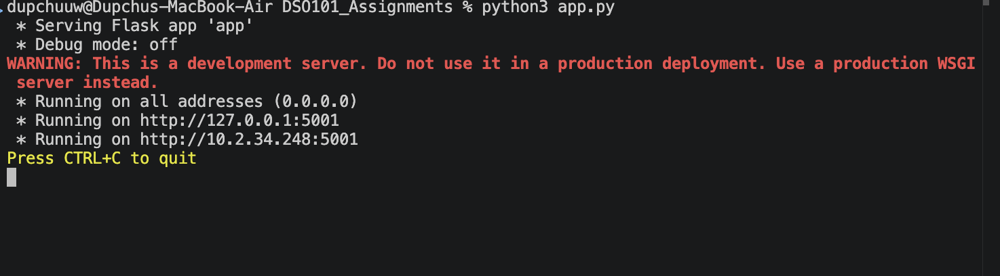
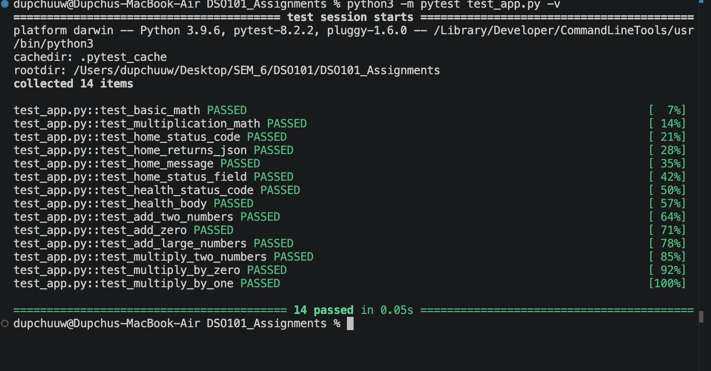
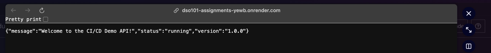
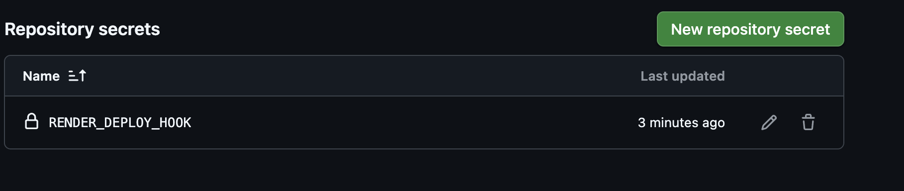
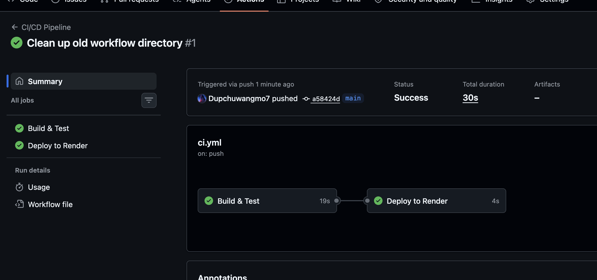

# CI/CD Pipeline Assignment


## 1. Introduction

This assignment demonstrates a complete, production-style CI/CD (Continuous Integration / Continuous Delivery) pipeline built with the following technology stack:

- **Backend:** Flask 3.0 (Python) REST API
- **Testing:** pytest with 14 unit tests across all endpoints
- **CI/CD:** GitHub Actions workflow (build → test → deploy)
- **Hosting:** Render cloud platform with auto-deploy on push

Every push to the main branch triggers an automated pipeline that installs dependencies, runs all tests, and — only if every test passes — deploys the updated application to Render. The entire workflow requires zero manual intervention.

## 2. Project Structure

The repository follows the structure specified in the assignment brief:

```
project/
├── app.py                       
├── test_app.py                  
├── requirements.txt              
├── render.yaml                   
├── README.md                    
└── .github/
    └── workflows/
        └── ci.yml                
```

Each file has a single, clearly defined responsibility, making the project easy to navigate and maintain.

## 3. Flask Application (`app.py`)

The backend exposes four HTTP endpoints over a lightweight Flask server:

| Method | Route | Description |
| --- | --- | --- |
| GET | `/` | Returns welcome message, status, and version |
| GET | `/health` | Health-check endpoint — returns HTTP 200 + `{status: healthy}` |
| GET | `/add/<a>/<b>` | Returns the sum of two integers as JSON |
| GET | `/multiply/<a>/<b>` | Returns the product of two integers as JSON |

All responses are JSON-encoded, making the API easily consumable by any front-end or automated tool.



## 4. Unit Tests (`test_app.py`)

The test suite uses pytest and Flask's built-in test client. It contains 14 independent tests grouped into four categories:

### 4.1 Arithmetic Sanity Checks

- `test_basic_math` → asserts `1 + 1 == 2`
- `test_multiplication_math` → asserts `3 * 4 == 12`

### 4.2 Home Route Tests

- `test_home_status_code` → `GET /` returns HTTP 200
- `test_home_returns_json` → response body is valid JSON
- `test_home_message` → JSON contains `message` key
- `test_home_status_field` → status field equals `running`

### 4.3 Health-Check Tests

- `test_health_status_code` → `GET /health` returns HTTP 200
- `test_health_body` → status field equals `healthy`

### 4.4 Addition & Multiplication Route Tests

- `test_add_two_numbers` → `/add/3/4` → 7
- `test_add_zero` → `/add/10/0` → 10
- `test_add_large_numbers` → `/add/1000/2000` → 3000
- `test_multiply_two_numbers` → `/multiply/3/4` → 12
- `test_multiply_by_zero` → `/multiply/99/0` → 0
- `test_multiply_by_one` → `/multiply/7/1` → 7

### 4.5 Local Test Output

Running `python3 -m pytest test_app.py -v` locally produces:



## 5. CI/CD Pipeline (`.github/workflows/ci.yml`)

The GitHub Actions workflow is structured as two sequential jobs:

### 5.1 Job 1 — `build-and-test`

Triggered on every push and pull-request to `main`. Steps:

- `actions/checkout@v3` — checks out the repository
- `actions/setup-python@v4` — installs Python 3.9
- `actions/cache@v3` — caches pip downloads between runs
- `pip install -r requirements.txt` — installs Flask and pytest
- `pytest test_app.py -v` — runs the full test suite

If any test fails, the pipeline stops and the deploy job is skipped.

### 5.2 Job 2 — `deploy` (depends on `build-and-test`)

Only runs on direct pushes to `main` (not pull-requests), and only after all tests pass. Steps:

- Sends an HTTP request to the Render deploy-hook URL stored as a GitHub secret (`RENDER_DEPLOY_HOOK`).
- Prints a deployment summary with branch name and commit SHA.

### 5.3 Pipeline Flow

```
┌─────────────────────────────────────────────┐
│          Push / PR to main branch           │
└───────────────────┬─────────────────────────┘
                    │
        ┌───────────▼──────────────┐
        │    Job: build-and-test   │
        │  1. Checkout             │
        │  2. Python 3.9 setup     │
        │  3. Cache pip            │
        │  4. Install deps         │
        │  5. pytest -v  (14 tests)│
        └───────────┬──────────────┘
                    │ (pass only)
        ┌───────────▼──────────────┐
        │      Job: deploy         │
        │  6. Trigger Render hook  │
        │  7. Print summary        │
        └──────────────────────────┘
```

## 6. Deployment to Render

Render provides a free-tier cloud platform that integrates directly with GitHub. Setup steps:

- **Step 1** — Create a Web Service on render.com and connect the GitHub repository.
- **Step 2** — Set Build Command to: `pip install -r requirements.txt`
- **Step 3** — Set Start Command to: `python app.py`


my app is live now.

- **Step 4** — Copy the Deploy Hook URL from the service's Settings → Deploy Hook.
- **Step 5** — Add the URL as a GitHub secret named `RENDER_DEPLOY_HOOK`.




The `render.yaml` file at the root of the repository acts as Infrastructure-as-Code, allowing Render to auto-configure the service on first import.

With this setup, every successful merge to `main` results in:

- GitHub Actions running all 14 tests
- On 100% pass rate, the Render deploy hook fires


- Render pulls the latest code, rebuilds, and restarts the service
- Live app is available at: `https://dso101-assignments-yewb.onrender.com/`

## 7. Conclusion

This assignment successfully implements a complete DevOps pipeline meeting all requirements:

- **Backend application** — Flask REST API with four functional endpoints.
- **Unit testing** — 14 pytest tests covering all routes, edge cases (zero, large numbers), and basic arithmetic; 100% pass rate confirmed locally.
- **CI/CD automation** — GitHub Actions workflow with two jobs: `build-and-test` runs on every push; `deploy` runs only on `main` after all tests pass.
- **Cloud deployment** — Render auto-deploys from GitHub on every successful pipeline run, with zero manual steps.
- **Documentation** — `README.md` covers setup, endpoints, pipeline flow, and Render configuration.

The pipeline enforces a quality gate: broken code can never reach production because deployment is gated behind a full test pass. This mirrors real-world DevOps best practices used in professional software teams.

